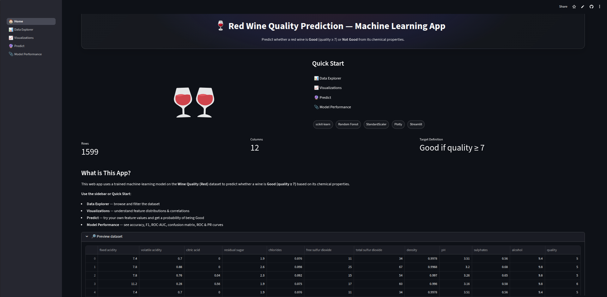
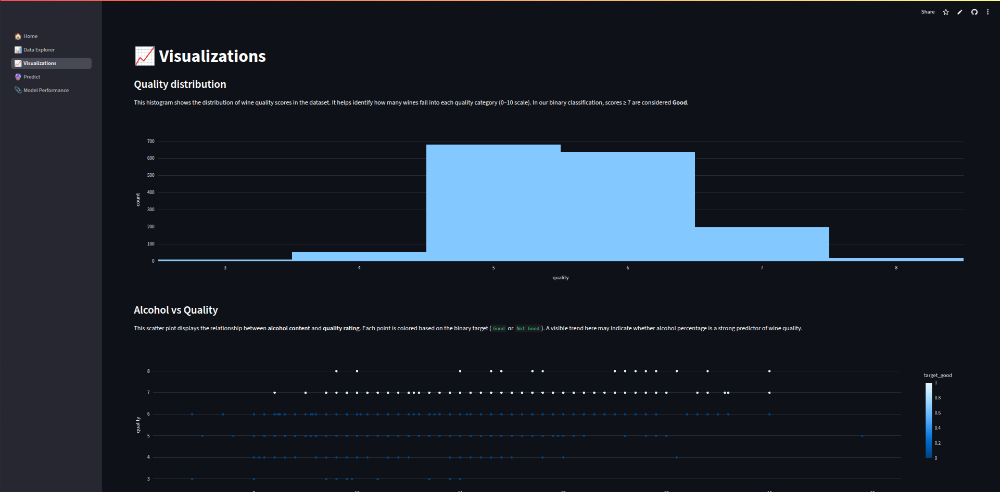
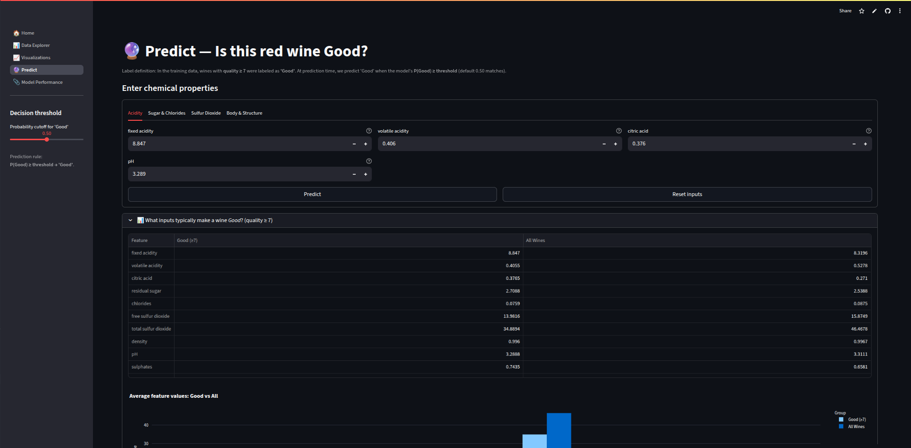
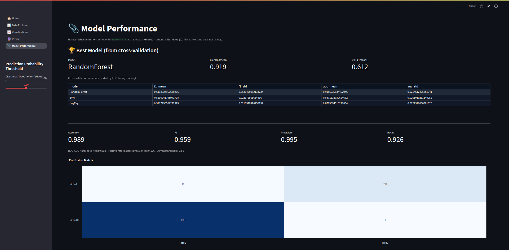

# Red Wine Quality Prediction – Machine Learning App


## Overview
This project demonstrates a **complete Machine Learning pipeline** — from **data exploration and model training** to **deployment with Streamlit Cloud**.  
Using the **Wine Quality Dataset**, the app predicts whether a wine is **Good (≥7)** or **Not Good (<7)** based on its physicochemical properties.

🔗 **Live Demo:** [Streamlit App](https://wine-quality-prediction-ml-app.streamlit.app/)  
🔗 **GitHub Repo:** [Repository Link](https://github.com/msafryx/wine-quality-prediction-ml-streamlit.git)

---

## Key Features
- **Data Explorer** – Interactive dataset preview & filtering  
- **Visualizations** – Histograms, scatter plots, correlation heatmap  
- **ML Predictions** – Input wine features and get instant classification  
- **Model Performance** – Metrics, confusion matrix, ROC curve  

---

## Project Structure
```
wine-quality-ml-app/
│── app.py                # Main Streamlit app
│── requirements.txt      # Dependencies
│── model.pkl             # Trained ML model
│── data/
│   └── winequality-red.csv
│── notebooks/
│   └── model_training.ipynb
│── README.md             # Documentation
```

---

## Installation

1. **Clone the Repository**
```bash
git clone https://github.com/your-username/wine-quality-ml-app.git
cd wine-quality-ml-app
```

2. **Create Virtual Environment**
```bash
python -m venv .venv
source .venv/bin/activate   # Mac/Linux
.venv\Scripts\activate      # Windows
```

3. **Install Dependencies**
```bash
pip install -r requirements.txt
```

4. **Run Locally**
```bash
streamlit run app.py
```

---

## Dataset
- **Source:** [Wine Quality Dataset – UCI/Kaggle](https://www.kaggle.com/datasets/uciml/red-wine-quality-cortez-et-al-2009)
- **Features:** 11 physicochemical attributes (e.g., pH, alcohol, sulphates)  
- **Target:** Binary classification → `Good (1)` if quality ≥ 7, else `Not Good (0)`  

---

## Model Training
- **Algorithms Evaluated:** Logistic Regression, Random Forest, SVM  
- **Best Model:** Random Forest (saved as `model.pkl`)  
- **Metrics:** Accuracy, F1 Score, ROC-AUC, Confusion Matrix  

📓 Full workflow in (https://colab.research.google.com/drive/1PeJUIbdN4N9c5D8EAB6NY5o8x3C77xOB?usp=sharing))

---

## Deployment
- Hosted on **Streamlit Cloud**  
- Auto-deploys from **GitHub main branch**  
- Accessible at the public demo link above  

---

## Tech Stack
- **Python 3.12+**  
- **Streamlit** – Web App Framework  
- **scikit-learn** – ML Training & Evaluation  
- **Pandas / NumPy** – Data Processing  
- **Matplotlib / Seaborn / Plotly** – Visualizations  

---

## App Screenshots

### Home Page


### Data Explorer


### Visualizations


### Prediction 


### Model Performance


---

## Resources
- [Streamlit Docs](https://docs.streamlit.io/)  
- [Scikit-learn Docs](https://scikit-learn.org/)  
- [Kaggle Dataset](https://www.kaggle.com/datasets)  

---

## 👨‍💻 Author
**Muhammed Safry**  
🔗 [LinkedIn](www.linkedin.com/in/muhammed-safry) 

---
